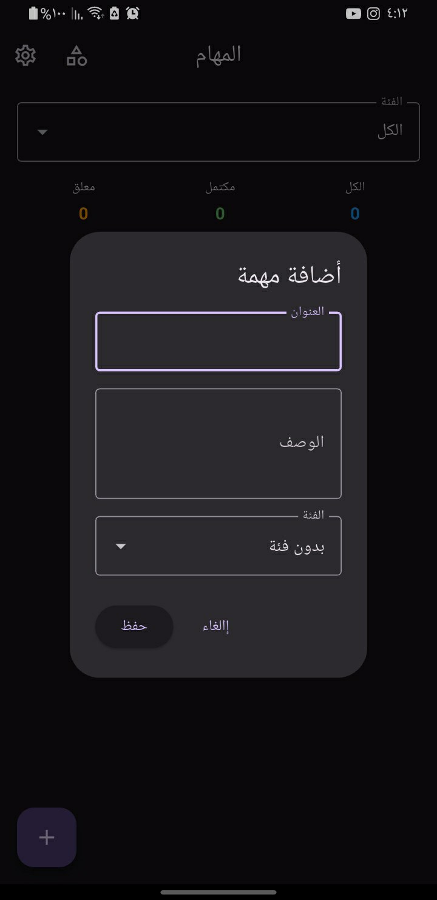
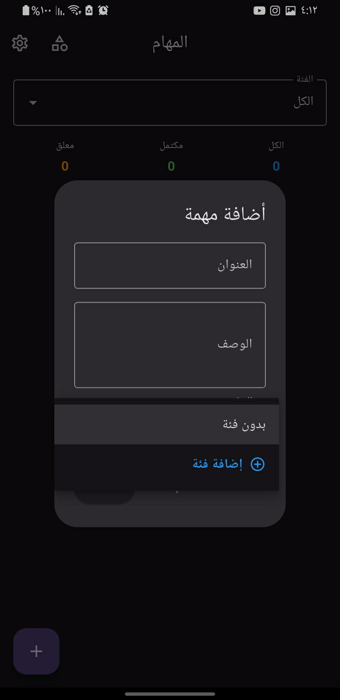
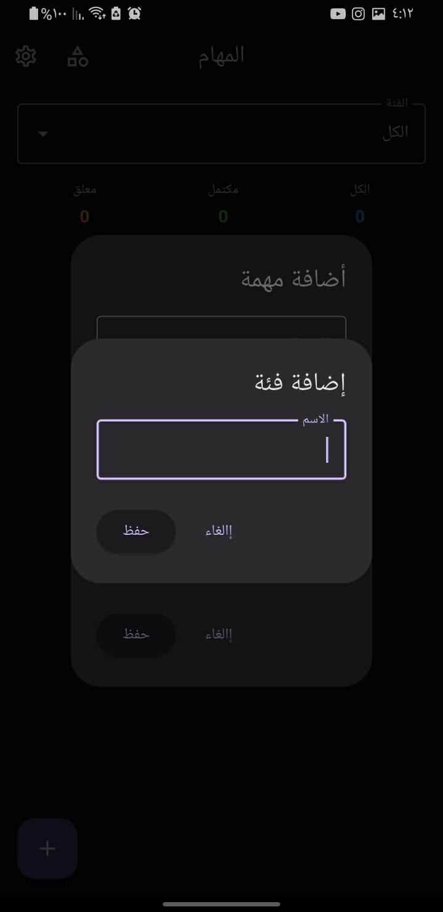
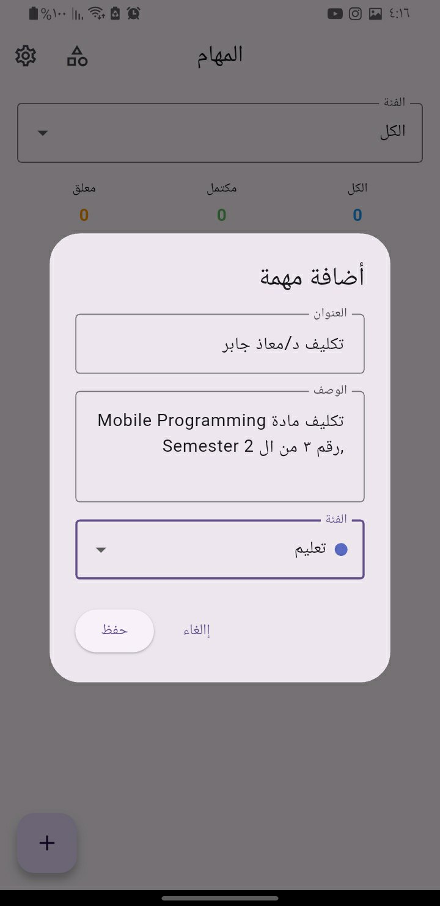
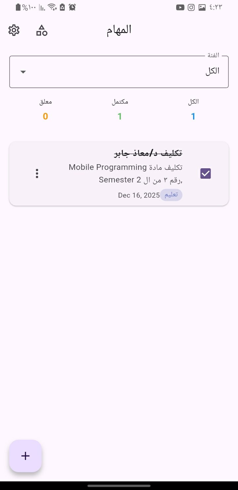

# Flutter Todo V2

---
هذا المشروع هو تطبيق قائمة مهام (Todo) مبني بـ Flutter، يستخدم مكتبة `GetX` لإدارة الحالة والتنقل، و`Hive` للتخزين المحلي.

نظرة عامة:

- البنية: Flutter + GetX (Controllers، حالة تفاعلية) + Hive (قاعدة محلية).
- النماذج: `Task` و `Category` مخزنة كمجرّدات Hive مع محولات (`adapters`).
- الميزات: إضافة/تعديل/حذف مهام وفئات، فلترة حسب الفئة، إعدادات مظهر ولغة (عربي/إنجليزي).

هيكل المشروع (ملفات مهمة):

- `lib/main.dart` — نقطة دخول التطبيق، تسجيل محولات Hive، إعداد `GetMaterialApp`.
- `lib/models/` — `task.dart`, `category.dart` (+ الملفات المولّدة `*.g.dart`).
- `lib/controllers/` — `task_controller.dart`, `category_controller.dart`, `theme_controller.dart`, `locale_controller.dart`.
- `lib/screens/` — شاشات الواجهة (`task_list_screen.dart`, `category_list_screen.dart`, `settings_screen.dart`).
- `lib/widgets/` — حوارات (dialogs) ومكونات قابلة لإعادة الاستخدام.
- `lib/helper/` — المسارات، صفحات التطبيق، الترجمات، السمات.

المتطلبات المسبقة:

- Flutter SDK (يفضّل القناة stable). نسخة Dart/Flutter المشار إليها في `pubspec.yaml` >= 3.10.0.
- محاكي أو جهاز لتشغيل التطبيق.

طريقة الإعداد (PowerShell على ويندوز):

1. جلب الحزم:

```powershell
flutter pub get
```

2. توليد محولات Hive (مهم):

```powershell
flutter pub run build_runner build --delete-conflicting-outputs
```

بعدها ستظهر الملفات المولّدة في `lib/models/` مثل `task.g.dart` و `category.g.dart`.

3. تشغيل التطبيق:

```powershell
flutter run
```

4. (اختياري) تشغيل التحليل الثابت:

```powershell
flutter analyze
```
نصائح تطويرية:

- لإعادة توليد المحولات بعد تعديل النماذج، أعد تشغيل:

```powershell
flutter pub run build_runner build --delete-conflicting-outputs
```
المساهمة:

إن أردت المساهمة: افعل Fork للمستودع، اعمل فرعًا للتطوير، شغل `flutter analyze` ثم افتح Pull Request.

---

### الصور
### 1


### 2


### 3


### 4


### 5


### 6


### 7


### 8


---